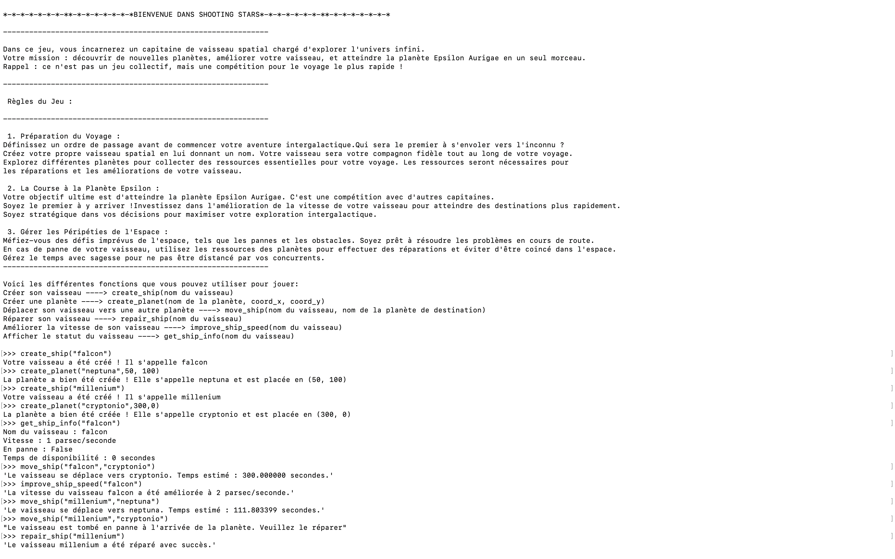

## Installation et Lancement

### Prérequis
- Python 3.x installé sur votre système

### Comment jouer

1. Ouvrez un terminal dans le dossier du jeu
2. Lancez Python :
   ```bash
   python3
   ```

3. Importez le jeu :
   ```python
   from main import *
   ```

4. Initialisez le jeu en appelant :
   ```python
   set_the_game()
   ```

5. Suivez les instructions qui s'affichent à l'écran pour jouer !

## Game preview


